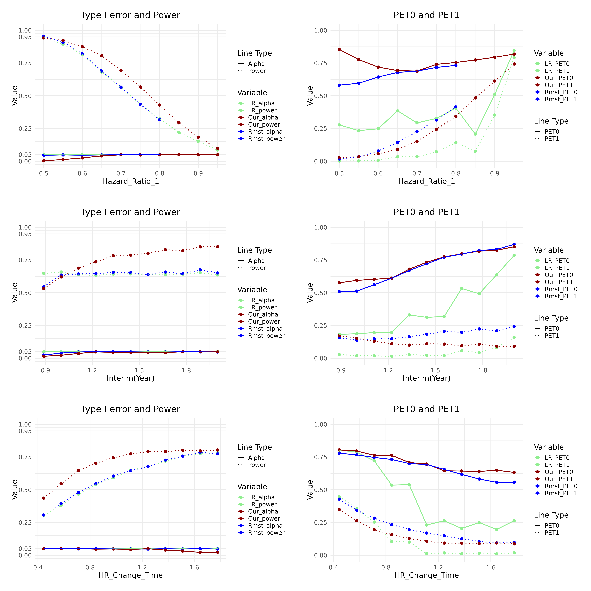

# RMST Two Stages Clinical Trial Design
This is the storage of the start up project.  
Hope I could publish a paper based on this for my Ph.D. application.  

## Compare 3 methods:
- 2 stages log rank test design (Jung 2017)   
    -  [Minjung Kwak & Sin-Ho Jung (2017) Optimal two-stage log-rank test for randomized phase II clinical trials, Journal of Biopharmaceutical Statistics, 27:4, 639-658, DOI: 10.1080/10543406.2016.1167073](https://www.tandfonline.com/doi/abs/10.1080/10543406.2016.1167073)  
    

-  Simple RMST difference (Eaton 2020, Shan 2021)    
    -  [Eaton A, Therneau T, Le-Rademacher J. Designing clinical trials with (restricted) mean survival time endpoint: Practical considerations. Clinical Trials. 2020;17(3):285-294. doi:10.1177/1740774520905563](https://journals.sagepub.com/doi/abs/10.1177/1740774520905563)


-  Special RMST rejection region (inspired by Litwin 2017)  
    -  [Litwin S, Basickes S, Ross E A. Two‐sample binary phase 2 trials with low type I error and low sample size[J]. Statistics in medicine, 2017, 36(9): 1383-1394.](https://onlinelibrary.wiley.com/doi/abs/10.1002/sim.7226)


Basically, our method is testing both RMST difference and the RMST of experiment group.  
## Hypothesis
$H_0:\ \lambda_E(t) > \lambda_C(t)$, where $\lambda$ is the hazard function  
$H_1:\ \lambda_E(t) < \lambda_C(t)$  

## Two stages trial rejection region (one-sided):
- 1. Log rank test
    - $\frac{W_1}{\sigma_1}>c_1$ & $\frac{W}{\sigma}>c$, where $\frac{W}{\sigma}>c$ is the normal log rank test statistics    
According to Jung(2017), two stages log-ranktest can reach a similar power as corresponding single stage test if the interim period, $c_1,\ c$ are well selected. 

$E, C$ are the RMST value of experiment group and the control group respectively.   
$\tau$ is the cutoff time point of interim period(1) and overall trial(2)  

- 2. Simple RMST Difference  
    - $E(\tau_1) - C(\tau_1) > m_1$ & $E(\tau_2)-C(\tau_2)>m_2$

- 3. Our RMST Rejection method
    - $E(\tau_1)-C(\tau_1)>m_1$ & $E(\tau_1)>t_1$ & $E(\tau_2)-C(\tau_2)>m_2\$ & $E(\tau_2)>t_2$  

****
## Asymptotic Normality of RMST:
```math
[E_1-C_1,\ E_1,\ E_2-C_2,\ E_2] \sim \mathcal{N}\ (\ \hat{\mu},\ \hat{\Sigma}\ )
```

```math
\hat{\Sigma} = 
 \left[
 \begin{matrix}
   Var(E_1)+Var(C_1) & Var(E_1) & Cov(E_1,E_2)+Cov(C_1,C_2) & Cov(E_1,E_2) \\
                   & Var(E_1) & Cov(E_1,E_2) & Cov(E_1,E_2) \\
                   &         & Var(E_2)+Var(C_2) & Var(E_2)\\
                   &         &                 & Var(E_2)\\
  \end{matrix}
\right]
```

### Estimated by Monte Carlo Simulation
Similar to Lu(2021):  
[Lu Y, Tian L. Statistical considerations for sequential analysis of the restricted mean survival time for randomized clinical trials[J]. Statistics in biopharmaceutical research, 2021, 13(2): 210-218.](https://www.tandfonline.com/doi/abs/10.1080/19466315.2020.1816491)

```math
 \left[
 \begin{matrix}
   Var(\hat{E_1}) & Cov(\hat{E_1}, \hat{E_2}) \\
   Cov(\hat{E_1}, \hat{E_2}) & Var{\hat{E_2}} \\
  \end{matrix}
  \right] = 

\frac{1}{B}\sum\limits_{i = 1}^{B} 
 \left[
 \begin{matrix}
   \hat{RMST_{E1}} - \bar{RMST_{E1}} \\
   \hat{RMST_{E2}} - \bar{RMST_{E2}} \\
  \end{matrix}
  \right] ^{\bigotimes2}_i  
 ```  
  
```math
  \bar{RMST_{E1}} = \frac{1}{B}\sum^{B}_{i = 1}RMST_{E1,i}
```  
The theoretical RMST value did not consider accrual and censoring distribution.

****

## Parameter Optimization (Grid Search)
Reference: Zhou(2017) BOP2 Bayesian design:  
[Zhou H, Lee J J, Yuan Y. BOP2: Bayesian optimal design for phase II clinical trials with simple and complex endpoints[J]. Statistics in medicine, 2017, 36(21): 3302-3314.](https://onlinelibrary.wiley.com/doi/abs/10.1002/sim.7338)  


In order to solve the critical values ($m_1,\ t_1,\ m_2,\ t_2$), a function that can control the normal probability is required. The following $\mathcal{f}(n)$ is what we proposed. 

```math
\large \mathcal{f}(n) = \mathcal{e}^{-\ \gamma · \frac{n}{N}}
```

$n$ is the sample size(2 arms) of interim period. $N$ is the final total sample size of 2 arms.   
Then we set the following constraints:   

```math
\begin{aligned}
\large P(E_1 - C_1 > m_1) &= \mathcal{f}(n)  \\
\large P(E_1 - C_1 > m_1\ \&\ E_1 > t_1) &= \lambda · \mathcal{f}(n) \\
\large P(E_2 - C_2 > m_2) &=  \mathcal{f}(N) \\
\large P(E_2 - C_2 > m_2\ \&\ E_2 > t_2) &= \lambda · \mathcal{f}(N) \\
0<\lambda<1,\ \gamma>0  
\end{aligned}
```

$\mathcal{f}(n)$ is a monotonously decereasing funciton of n, which means that two probability constraints in interim period will go up when the interim sample size n decrease.  
#### It leads to a small early stop probability with an insufficient interim sample size.  
Then we grid search $(\lambda, \gamma)$ . Each pair of $(\lambda, \gamma)$ determines a set of ($m_1,\ t_1,\ m_2,\ t_2$) by normal calculation. Record critical values sets that yield the desirable overall type I error $\alpha$:  

```math  
\large P(E_1-C_1>m_1\ \&\  E_1>t_1\ \&\  E_2 - C_2>m_2\ \&\  E_2>t_2\ |H_0) < \alpha
```

#### Find the most powerful one under $H_1$ among these ($m_1,\ t_1,\ m_2,\ t_2$)  


****

## Result
### Under Early Difference Scenario
The survival function of two groups are shown below:


The Type I error, Power, Probability of Early Termination under H0 and H1 are shown in the graph. We apply constant accrual rate with a fixed overall sample size N. The longer the interim period, the larger interim sample size n. 
  

The graph shows us that our method hava higher power while preserving the type I error under different early difference settings. Higher PET0 and relatively acceptable sacrifice of PET1. 

### Robustness
The following graph shows the robustness of 


****
All codes are in R. Presented in notebook R kernel.  
All functions that used for simulation is stored at [Function.R](Rfiles/Function.R).  
The simulation processes of single stage and two stages are stored at different ipynb files.


--------------
Vamos García

