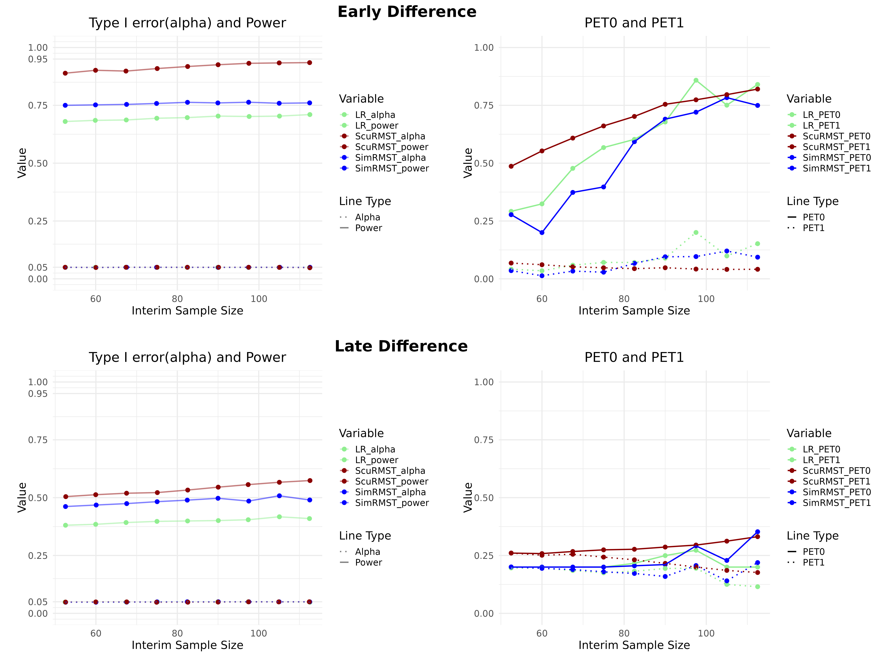

# Sculpted RMST Two Stages Double-arm Clinical Trial Design
This is the storage of the start up project.  
Hope I could publish a paper based on this for my Ph.D. application.  

## Flow Chart of Sculpted RMST design
 

## Compare 3 methods:
- 2 stages log rank test design (Jung 2017)   
    -  [Minjung Kwak & Sin-Ho Jung (2017) Optimal two-stage log-rank test for randomized phase II clinical trials, Journal of Biopharmaceutical Statistics, 27:4, 639-658, DOI: 10.1080/10543406.2016.1167073](https://www.tandfonline.com/doi/abs/10.1080/10543406.2016.1167073)  
    

-  Simple RMST difference (Eaton 2020, Shan 2021)    
    -  [Eaton A, Therneau T, Le-Rademacher J. Designing clinical trials with (restricted) mean survival time endpoint: Practical considerations. Clinical Trials. 2020;17(3):285-294. doi:10.1177/1740774520905563](https://journals.sagepub.com/doi/abs/10.1177/1740774520905563)


-  Special RMST rejection region (inspired by Litwin 2017)  
    -  [Litwin S, Basickes S, Ross E A. Two‐sample binary phase 2 trials with low type I error and low sample size[J]. Statistics in medicine, 2017, 36(9): 1383-1394.](https://onlinelibrary.wiley.com/doi/abs/10.1002/sim.7226)


Basically, our method is testing both RMST difference and the RMST of experiment group.  
## Hypothesis
$H_0:\ \lambda_E(t) > \lambda_C(t)$, where $\lambda$ is the hazard function  
$H_1:\ \lambda_E(t) < \lambda_C(t)$  

## Two stages trial rejection region (one-sided):
- 1. Log rank test
    - $\frac{W_1}{\sigma_1}>c_1$ & $\frac{W}{\sigma}>c$, where $\frac{W}{\sigma}>c$ is the normal log rank test statistics    
According to Jung(2017), two stages log-ranktest can reach a similar power as corresponding single stage test if the interim period, $c_1,\ c$ are well selected. 

$R_E,\ R_C$ are the RMST value of experiment group and the control group of interim period(1) and overall trial(2)respectively. $D_i = R_{Ei} - R_{Ci}$.

- 2. Simple RMST Difference  
    - $D_1 > m_1 \cap\ D_2 > m_2$

- 3. Our RMST Rejection method
    - $D_1 > m_1\ \cap\ R_{E1}> q_1\ \cap\ D_2 > m_2\ \cap\ R_{E2}> q_2$  

****
## Asymptotic Normality of RMST:
```math
[D_1,\ R_{E1},\ D_2,\ R_{E2}] \sim \mathcal{N}\ (\ \hat{\mu},\ \hat{\Sigma}\ )
```

### Estimated by Monte Carlo Simulation
Similar to Lu(2021):  
[Lu Y, Tian L. Statistical considerations for sequential analysis of the restricted mean survival time for randomized clinical trials[J]. Statistics in biopharmaceutical research, 2021, 13(2): 210-218.](https://www.tandfonline.com/doi/abs/10.1080/19466315.2020.1816491)

```math
 \left[
 \begin{matrix}
   Var(\hat{E_1}) & Cov(\hat{E_1}, \hat{E_2}) \\
   Cov(\hat{E_1}, \hat{E_2}) & Var{\hat{E_2}} \\
  \end{matrix}
  \right] = 

\frac{1}{B}\sum\limits_{i = 1}^{B} 
 \left[
 \begin{matrix}
   \hat{D}_{1i} - \bar{D}_1\\
   \hat{R}_{E1i} - \bar{R}_{E1}
  \end{matrix}
  \right] ^{\bigotimes2} 
 ```  
  
```math
  \bar{D}_1 = \frac{1}{B}\sum_{i=1}^B \hat{D}_{1i}
```  
The theoretical RMST value did not consider accrual and censoring distribution.

****

## Parameter Optimization (Grid Search)
Reference: Zhou(2017) BOP2 Bayesian design:  
[Zhou H, Lee J J, Yuan Y. BOP2: Bayesian optimal design for phase II clinical trials with simple and complex endpoints[J]. Statistics in medicine, 2017, 36(21): 3302-3314.](https://onlinelibrary.wiley.com/doi/abs/10.1002/sim.7338)  


In order to solve the critical values $(m_1,\ q_1,\ m_2,\ q_2)$, a function that can control the normal probability is required. 

We proposed $\mathcal{f}(n) = \mathcal{e}^{-\ \gamma · \frac{n}{N}}$, where $\gamma > 0$. 

$\tilde{N}$ is the sample size(2 arms) of interim period. $N$ is the final total sample size of 2 arms.  Then we set the following constraints:   

```math
\begin{aligned}
Prob\ (\ \hat{R}_{E1}(\tau_1)> q_1\ |\ \hat{D}_1(\tau_1) > m_1 ) &=  f(\tilde{N}) \\
Prob\ (\ \hat{R}_{E2}(\tau_2)> q_2\ |\ \hat{D}_2(\tau_2) > m_2) &= f(N) \\
\lambda \in (0,1).\\ 
\end{aligned}
```
The distribution of $E_i\ |\ D_i > m_i$ can be derived by conditional normality, double expection and variance formula.


$\mathcal{f}(\tilde{N})$ is a monotonously decereasing funciton of $\tilde{N}$, which means that two probability constraints in interim period will go up when the interim sample size $\tilde{N}$ decrease.  
#### It leads to a small early stop probability with an insufficient interim sample size.  
Then we search $\gamma$ within a certain range, say (-1,1) . Each $\gamma$ determines a set of ($m_1,\ q_1,\ m_2,\ q_2$) by normal calculation. Record critical values sets that yield the desirable overall type I error $\alpha$:  

```math  
\large \alpha = P(\hat{D}_1(\tau_1) > m_1\ \cap\ \hat{R}_{E1}(\tau_1)> q_1\ \cap\ \hat{D}_2(\tau_2) > m_2\ \cap\ \hat{R}_{E2}(\tau_2)> q_2\ |\ H_0)
```


****
## Result
### Two-stage Optimal Design Minimizing $\overline{EN}$ 
### 1. Under Proportional Hazard Scenario  
The result is shown in table 1 in paper


### 2. Under Early or Late Difference Scenario
The survival function of two groups are shown below: 
<p align="center"> 

</p>

The comparison of three methods under different setting is shown below:  
  

The graph shows us that our method have higher power while preserving the type I error under different early difference settings. Higher PET0 and relatively acceptable sacrifice of PET1. 


*****
### Visualization of the bivariate normal projection of RMST in interim and final 

  

The dotted lines are exmaple decision boundaries and shaded area is the critical region of a most powerful design . The volumes of the green and orange patterns within the shaded regions represent 
```math
\begin{aligned}
Prob\ (\hat{D}_i > m_i \cap \hat{R}_{Ei}> q_i &\mid H_1 ) \\
Prob\ (\hat{D}_i > m_i \cap \hat{R}_{Ei}> q_i &\mid H_0) \\
\end{aligned}
```
, which is corresponding to power and type I error respectively. It is clear that Sculpted RMST with two decision boundaries is more flexible than Simple RMST. 

****
### Visualization of Sculpted Rejection Region 

  

The data points in overall rejection region of $H_1$ in 10000 simulated trials. Each dot in subplot A representing a pair of $({R}_{E1},R_{C1})$, which is one simulated trial in interim stage, has a corresponding dot with the same color in subplot B indicating the final stage of the same trial. The shaded regions are the critical regions interaction of simple and Sculpted RMST. Lines are most powerful decision boundaries of two methods in two stages. 1008 orange dots move out of the shaded region from interim to final, which is the main source of additional power of Sculpted RMST compared with Simple RMST. More precisely, there are more simulated trials with small $D_2$ but large $R_{E2}$ at final stage fail to reject $H_0$ due to the stringent boundary of $D_2$ in Simple RMST(horizontal dotted line).


****
### Global Robustness
Within the hypothesis of a trial: 
```math
\begin{aligned}
H_0&:\ \lambda_E = \lambda_C = \lambda_0,\\
H_1&:\ \lambda_C = \lambda_0,\ \lambda_E = \lambda_1, \nonumber
\end{aligned}
```
The following graph shows the robustness of three methods when the real hazard drift away from the assumed value. The critical values calculated under this setting of orange dotted lines are saved then plugged into the simulated data under different $\lambda_0$(subplot A) or $\lambda_1$(subplot B). 10000 pairs of experimental and control groups survival data are generated under each $\lambda_0$ or $\lambda_1$ while preserving the hazard of the other group. The change of Power and PET1 is shown below(The PET0 and type I error should be consistant across different HR).  The actual $\alpha$ and power of the Sculpted RMST will deviate more from the expected stated level compared to the other two methods if the assumed hazard in control group is inaccurate. However if only $\lambda_1$ drifts from the stated number, our method can perform as robustly as the Simple RMST and log-rank test.

  


****
All codes are in R. Presented in notebook R kernel.  
All functions that used for simulation is stored at [Function.R](Rfiles/Function.R).  
The simulation processes of single stage and two stages are stored at different ipynb files.


--------------
By García

